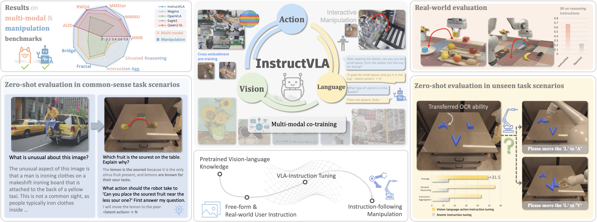

<br>
<p align="center">
  <h1 align="center"><strong>InstructVLA:<br>Vision-Language-Action Instruction Tuning<br>from Understanding to Manipulation</strong></h1>
  <p align="center">
    <a href='' target='_blank'>Shuai Yang*</a>, <a href='' target='_blank'>Hao Li*</a>, <a href='https://yilunchen.com/about/' target='_blank'>Yilun Chen</a>, <a href='' target='_blank'>Bin Wang</a>, <a href='' target='_blank'>Yang Tian</a>, <a href='https://tai-wang.github.io/' target='_blank'>Tai Wang</a>, <br><a href='https://hanqingwangai.github.io/' target='_blank'>Hanqing Wang</a>, <a href='https://scholar.google.co.uk/citations?user=r6CvuOUAAAAJ&hl=en' target='_blank'>Feng Zhao</a>, <a href='' target='_blank'>Yiyi Liao</a>, <a href='https://oceanpang.github.io/' target='_blank'>Jiangmiao Pang</a>
    <br>
    * Equal Contributions
    <br>
    University of Science and Technology of China, Zhejiang University, <br> Shanghai Artificial Intelligence Laboratory
    <br>
  </p>

  <!-- <p align="center"><strong>Under Review</strong></p> -->
</p>

<div id="top" align="center">

[](http://arxiv.org/abs/2507.17520/)
[](https://yangs03.github.io/InstructVLA_Home/)

</div>


<!-- ## 📋 Contents

- [🔥 Highlight](#highlight)
- [🛠️ Getting Started](#getting_started)
- [📌 TODO](#todo)
- [🔗 Citation](#citation)
- [📄 License](#license)
- [👏 Acknowledgements](#acknowledgements) -->


## 🔥 Overview <a name="overview"></a>

1. We propose **InstructVLA**, a VLA architecture and training pipeline that emphasizes the importance of language capability in VLAs by efficiently preserving pretrained vision-language knowledge from VLMs while integrating manipulation as a component of instruction following.
2. We design **a practical data and evaluation pipeline for vision-language-action instruction following**, supported by 650K tailored VLA-IT annotations and a manually curated benchmark suite, enabling evaluation of VLAs' instruction generalization capabilities.
3. InstructVLA achieves leading performance across robotic manipulation tasks, multimodal benchmarks, and real-world deployments, enabling intuitive and controllable human-robot interaction.





<!-- ## 🛠️ Getting Started <a name="getting_started"></a> -->


<!-- ### Download Data and Assets -->


<!-- ### Usage -->


## 📌 TODO <a name="todo"></a>
### Code, Data, Bench and checkpoints coming soon — stay tuned! 🚀
- [ ] Release the VLA-IT dataset. 
- [ ] Release the SimplerEnv-Instruct.
- [ ] Release the checkpoints and training code for post-training and finetuning.
- [ ] More powerful InstructVLA v2.0.


## 🔗 Citation <a name="citation"></a>

<!-- If you find our work helpful, please cite: -->

```bibtex
@misc{2506.19816,
  Author = {Hao Li and Shuai Yang and Yilun Chen and Yang Tian and Xiaoda Yang and Xinyi Chen and Hanqing Wang and Tai Wang and Feng Zhao and Dahua Lin and Jiangmiao Pang},
  Title = {CronusVLA: Transferring Latent Motion Across Time for Multi-Frame Prediction in Manipulation},
  Year = {2025},
  Eprint = {arXiv:2506.19816},
  }
```
